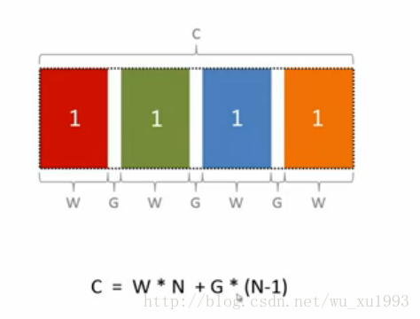
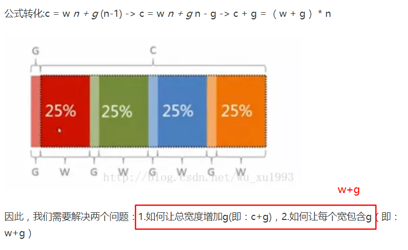

### css知识点记录  
1. 对于`position:absolute`,元素定位将相对于最近的一个已定位的父元素，如果没有的话<font color="red">相对于`body`</font>   
2. flex布局的知识导图：  
      
    重点：  
        1. `flex-grow`:定义项目的放大比例，默认为0，即存在剩余空间也不放大  
        2. `flex-shrink`:定义项目的缩小比例，默认为1，即如果空间不足，该项目将缩小  
        3. `flex`: 项目在容器上如何伸缩。  
            <font color="red">1个值： 无单位：grow,有单位：basis  </font>  
            2个值:  无单位：grow & shrink,有单位：grow & basis  
            3个值：grow & shrink & basis  
        4. `flex-basis`: 在不伸缩的情况下子容器的原始尺寸。主轴为横向时代表宽度，主轴为纵向时代表高度。
3. 等分布局的实现思想  
     
     
4. margin的零活运用（双飞翼布局）  
   1. margin百分比  
      规定基于父元素的宽度的百分比的外边距  
   2. margin负边距  
5. 设置初始化`ie`盒模型：`box-sizing:border-box`
   ```css
   html {
       box-sizing: border-box;
   }
   *,
   *:after,
   *:before {
       box-sizing: inherit;
   }
   ```
   选择请*无法覆盖到伪元素，所以要给`:after`和`:before`分别设置，  
   然后通过继承的方式应用到所有元素，方便为某个元素和其后代元素设置`box-sizing:content-box`
   